# DCIT_205_IA
## Title
Computer Science Department 

## Introduction and Purpose of Websites
This website's purpose is to operate as a primary online center for information about the department's activities, resources, and communication.

## Features
- Contains a testmonial from students
- Contains a search box where students can search for courses
- Contains a back to top button to ensure ease of using the website
- Allows students and Staff to log into their accounts in the department
- Contains a form to help students Register for short courses
- Students can lodgee complains to the department

## Cloning and setting up the Project
- Click on the "code" button and copy the HTTPS or SSH url of the repository 
- Open the Command prompt or Terminal and navigate to to the directory you want to clone 
- Clone the repository using the command "git clone <repository url>"
- Open your IDE and navigate to the Repository

## Skills Acquired 
- got a better understanding of how Javascript, Html and CSS by implementing them in the website 

## Technologies used 
- HTML
- CSS
- Javascript 

## Student Details 
- Justine Addo
- 11170480

## Screenshots
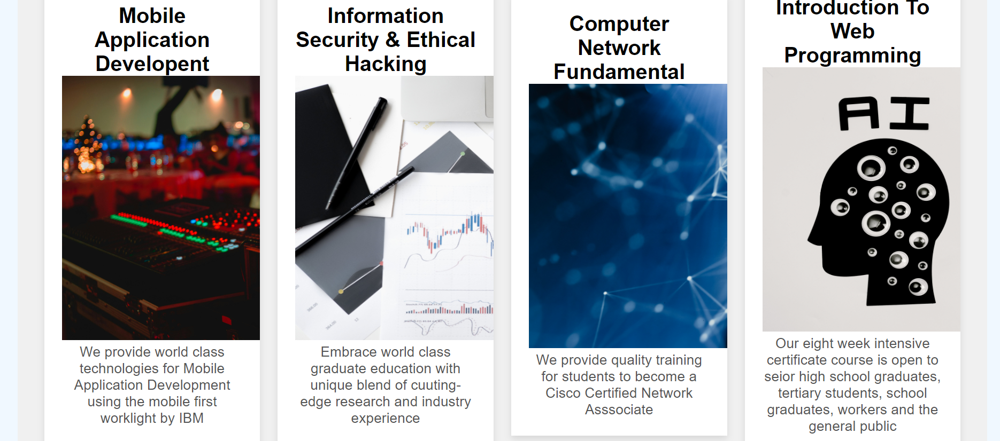
 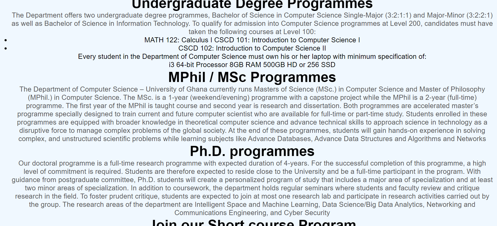
  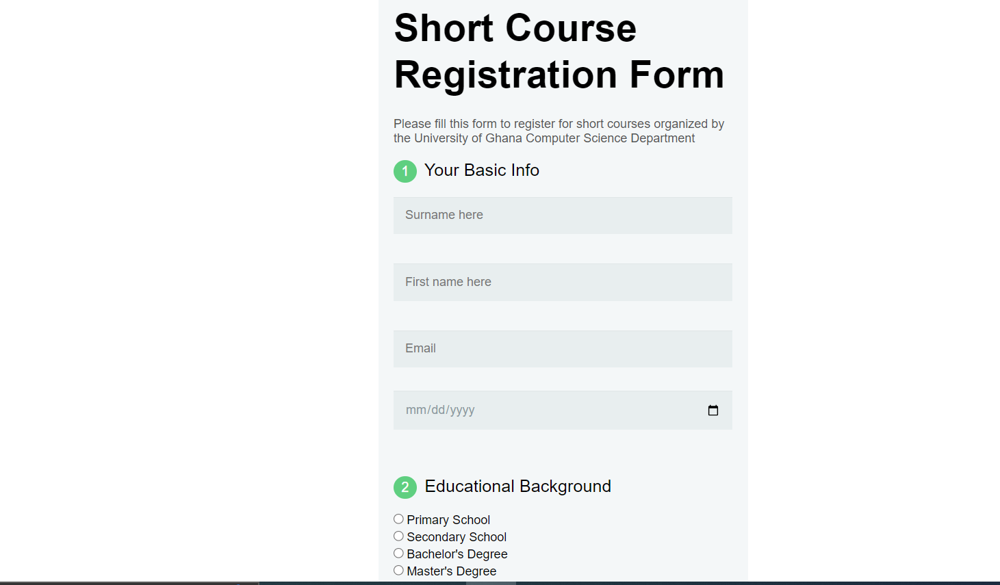
 
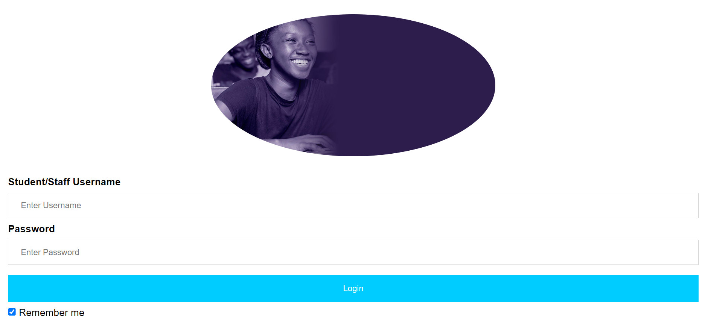
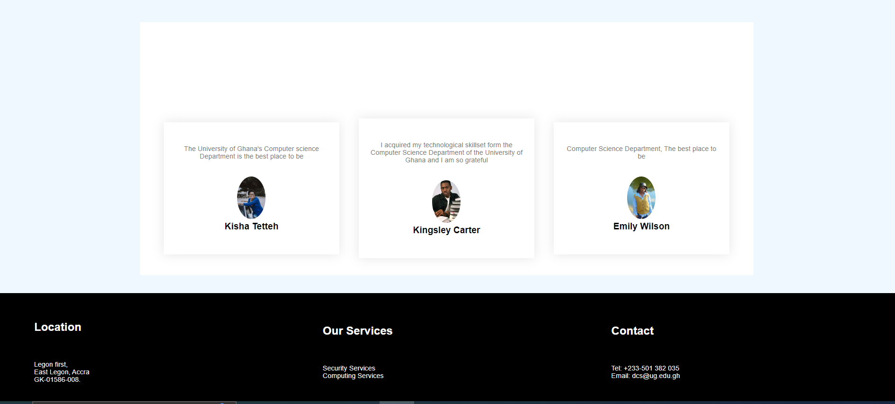 
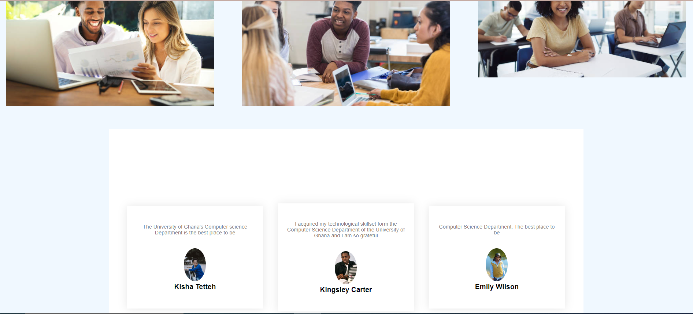
 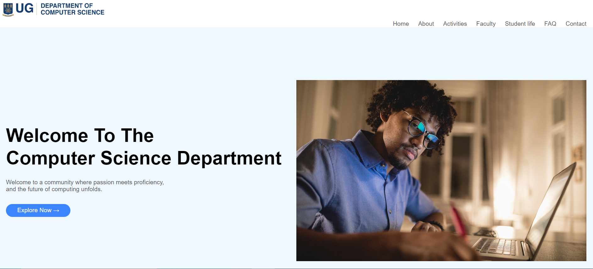 
  
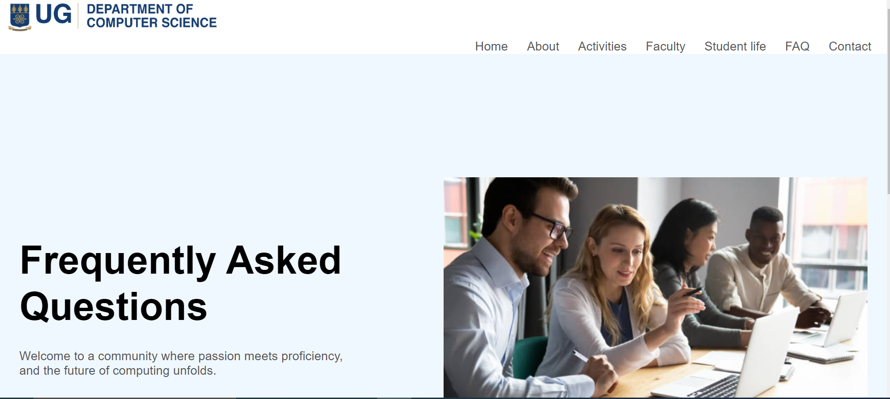
 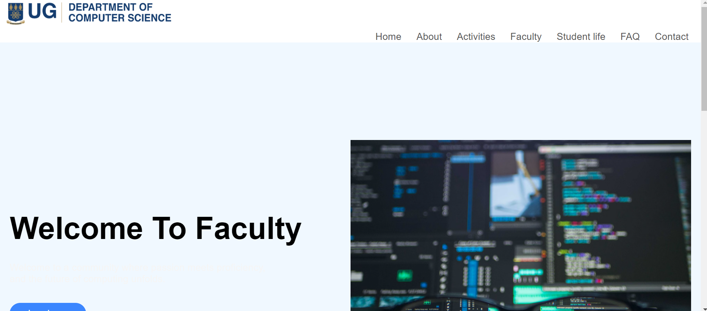
 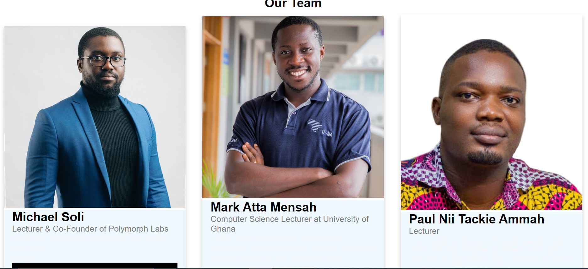
  
 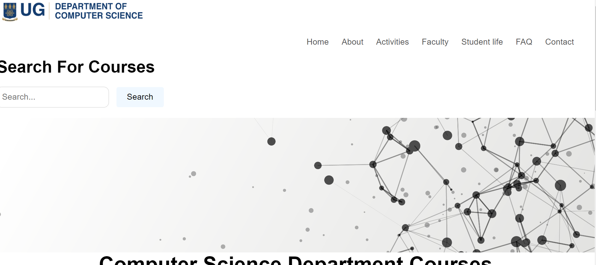
 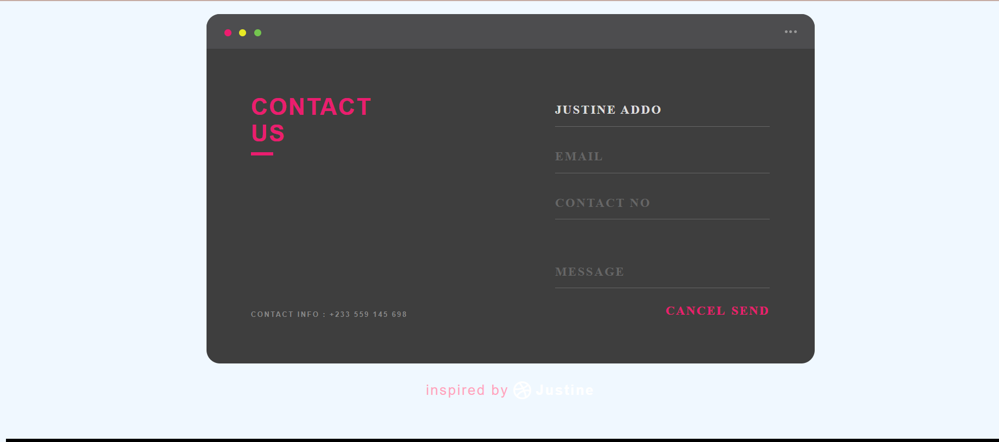
 [Alt text](11170480_DCIT205/activities2.PNG)
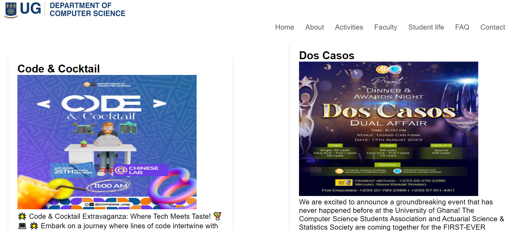 
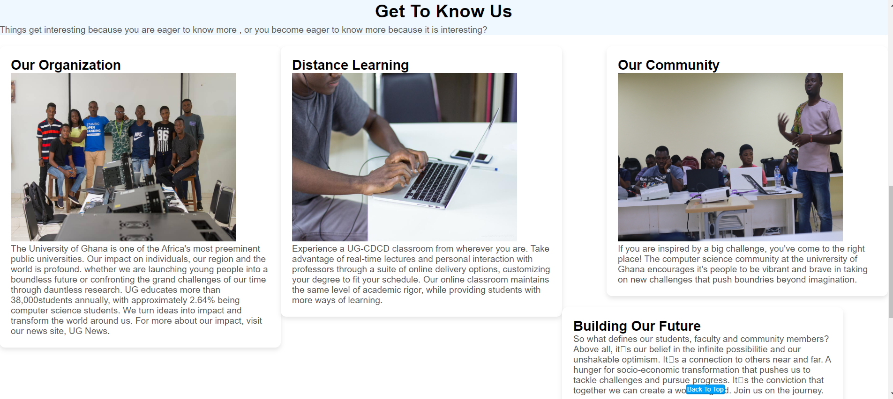
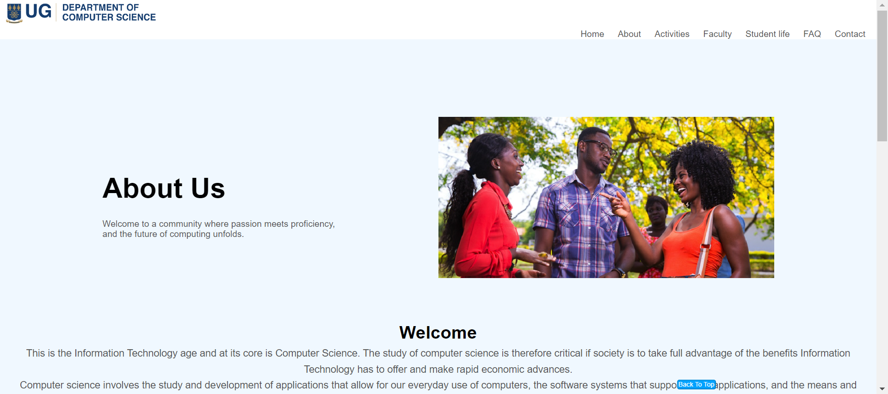

